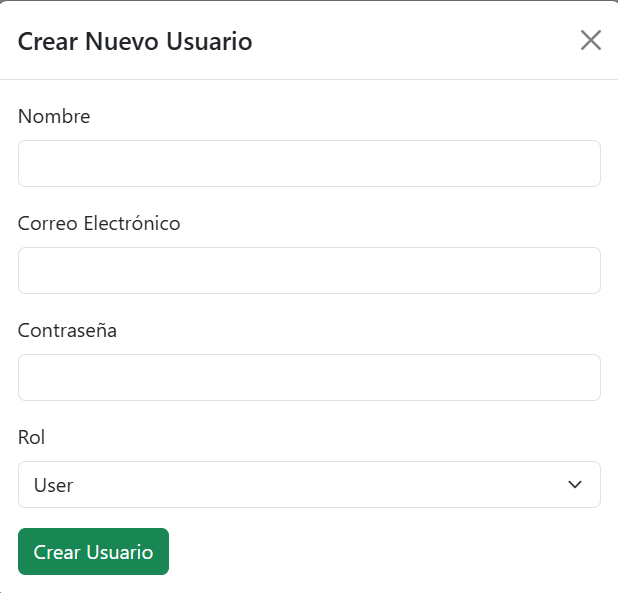

# User Management Application

## Descripción

Esta aplicación permite a los administradores gestionar usuarios de manera eficiente. Los administradores pueden crear, editar, eliminar y verificar usuarios. La aplicación está diseñada para proporcionar una interfaz de usuario profesional y fácil de usar.

## Funcionalidades

- **Dashboard de SuperAdmin**: Un panel de control para el SuperAdmin donde puede gestionar todos los usuarios.
- **Dashboard de Admin**: Un panel de control para los administradores donde pueden gestionar los usuarios.
- **Gestión de Usuarios**: Crear, editar, eliminar y verificar usuarios.
- **Roles de Usuario**: Asignar roles a los usuarios (SuperAdmin, Admin, User).
- **Verificación de Email**: Verificar y desverificar el email de los usuarios.

## Imágenes

### 1. Login

Aquí podemos ver el formulario de login del programa.

### 2. Register

Aquí podemos ver el formulario de register del programa.

### 3. Reset

Aquí podemos ver el formulario de resetear contraseña del programa.

### 4. Logged in

Aquí podemos ver el dashboard de cuando hacemos login.

### 5. Super Admin Dashboard

Aquí podemos ver el dashboard del super admin en el programa.

### 6. Editar Usuario

Aqui podemos editar al usuario.

### 7. Eliminar Usuario

Aqui podemos eliminar un usuario, y nos salta el mensaje de aviso.

### 8. Verificar Usuario

Aqui podemos verificar un usuario, y nos salta el mensaje de aviso.

### 9. Admin Dashboard

Aquí podemos ver el dashboard del admin en el programa.

### 10. Crear Usuario

Aqui podemos crear un nuevo usuario.


## Instalación

1. Clona el repositorio:
    ```sh
    git clone https://github.com/Jferrui0803/firstUserApp.git
    ```

2. Instala las dependencias:
    ```sh
    composer install
    npm install
    ```

3. Configura el archivo [.env](http://_vscodecontentref_/2):
    ```sh
    cp .env.example .env
    php artisan key:generate
    ```

4. Ejecuta las migraciones:
    ```sh
    php artisan migrate
    ```

5. Inicia el servidor:
    ```sh
    php artisan serve
    npm run dev
    ```

## Uso

1. Accede a la aplicación en tu navegador:
   
2. Inicia sesión con tus credenciales de SuperAdmin o Admin.

3. Utiliza el panel de control para gestionar los usuarios.

## Contribución

Si deseas contribuir a este proyecto, por favor sigue los siguientes pasos:

1. Haz un fork del repositorio.
2. Crea una nueva rama (`git checkout -b feature/nueva-funcionalidad`).
3. Realiza tus cambios y haz commit (`git commit -am 'Añadir nueva funcionalidad'`).
4. Sube tus cambios (`git push origin feature/nueva-funcionalidad`).
5. Abre un Pull Request.

## Licencia

Este proyecto está licenciado bajo la Licencia MIT. Consulta el archivo LICENSE para más detalles.